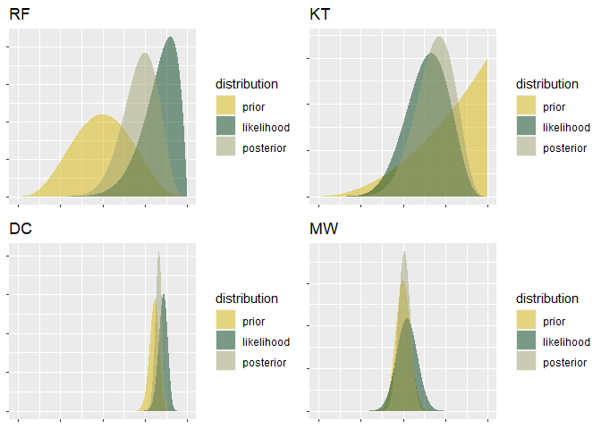
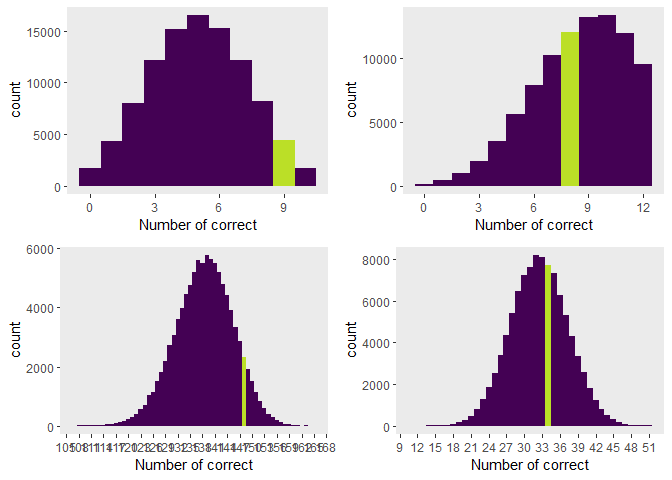
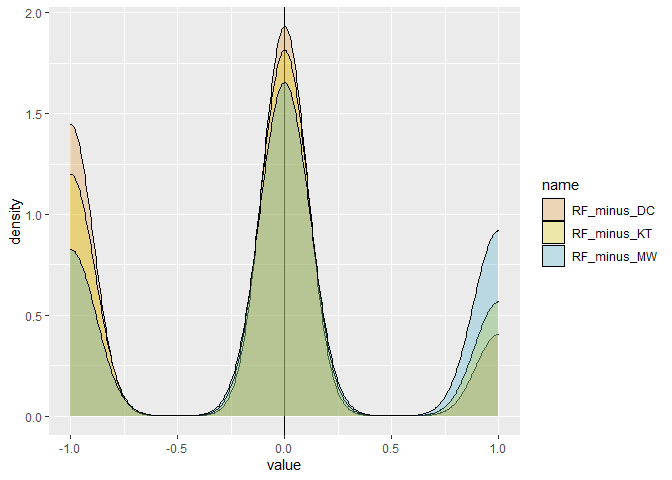

# Point 1 (Prior influence). 

You all got this point, just wanted to say that this was cool. 
Given a prior with a certain amount of information (confidence)
the prior will influence the posterior distribution less when we
have more data (stronger likelihood). Direct consequence of the
posterior being a weighted sum of the likelihood and the prior. 

# Point 2 (fitted vs. predicted). 

Most of you already have a good grasp of when we work with
fitted values of parameters (e.g. prior, likelihood, posterior) 
and when we work with predictive values. However, there was some
confusion in some groups. 
(In this case when we do not work with actual models in brms,
we get samples from parameters with sample() and predictive
prior and posterior with rbinom(n = ..., size = ..., prob = ...). 

E.g. some groups showed actual predictions (it seems) when 
asked to show their prior/posterior, and some groups said that they 
compared predictions when they actually showed samples from
parameters (or fitted values from params). 
So - let us just briefly talk about this. 

So, for the 2a question "show plots of the prior / posterior" 
what you want is to show the actual parameter values
(not predictions). In this case, all of our parameter
values (prior) but also likelihood and posterior are
bounded within [0, 1]. 


```r
# 2a. Produce plots of the prior, and posterior for each teacher

# set working directory.
# you'll have to change this of course (sorry). 
setwd("C:/Users/95/Dropbox/MastersSem2/CompModTA/ModelingFeedback/A1-feedback")

# packages
pacman::p_load(tidyverse, RColorBrewer, wesanderson, cowplot)

# load some data I created (ngrid = 1e4) and flat prior. 
d <- read_csv("prior_posterior.csv") %>%
  glimpse()
```

```
## 
## -- Column specification --------------------------------------------------------
## cols(
##   p_grid = col_double(),
##   prior = col_double(),
##   likelihood = col_double(),
##   posterior = col_double(),
##   Teacher = col_character()
## )
```

```r
# n_grid  
n_grid = 1e4

# plot of prior (shared) and posteriors (individual for teachers). 
d %>% 
  ggplot(aes(x = p_grid, ymin = 0, ymax = posterior, fill = Teacher)) +
    geom_ribbon(alpha = 0.5) + 
    geom_line(aes(x = p_grid, y = posterior)) +
    geom_line(aes(x = p_grid, y = prior/n_grid), color = "red") + 
    scale_fill_brewer(palette = "Dark2") +
    labs(title = "Teacher knowledge with flat prior",
         y = "posterior density",
         x = "probability of knowing stuff (p_grid)") +
    theme(axis.ticks.y=element_blank(),
          axis.text.y=element_blank())
```

<!-- -->

# Point 3: comparing two data-collections (visually). 
Many of you did this in reasonable fashion.
Just wanted to show one way where it becomes
really obvious how the posterior is a weighted
sum of the prior and likelihood. 

# Plotting function (collapsed). 


```r
# First: visually comparing the two data collections: 
plot_fun2 <- function(d, teacher){
  
  p <- d %>%
    filter(Teacher == teacher) %>%
    mutate(likelihood = likelihood/sum(likelihood)) %>%
    pivot_longer(cols = prior:posterior) %>%
    mutate(distribution = as_factor(name)) %>%
    ggplot(aes(x = p_grid, ymin = 0, 
               ymax = value, fill = distribution)) +
    geom_ribbon(alpha = 0.5) + 
    scale_fill_manual(values = wes_palette("Cavalcanti1")) +
    theme(axis.text.x=element_blank(),
          axis.text.y=element_blank(),
          axis.title.x=element_blank()) +
    labs(title = teacher)

  return(p)
  
}
```


```r
# load some data I created based on initial
# flat prior and then updated with the new data. 
d1 <- read_csv("new_posterior.csv")
```

```
## 
## -- Column specification --------------------------------------------------------
## cols(
##   p_grid = col_double(),
##   prior = col_double(),
##   likelihood = col_double(),
##   posterior = col_double(),
##   Teacher = col_character()
## )
```

```r
# plot inspired by "recoded" (thanks Paul). 
# Generate a plot for each teacher and then plot_grid. 
Riccardo <- plot_fun2(d1, "RF")
Tylen <- plot_fun2(d1, "KT")
Daina <- plot_fun2(d1, "DC")
Mikkel <- plot_fun2(d1, "MW")
plot_grid(Riccardo, Tylen, Daina, Mikkel)
```

<!-- -->

# Point 4: (Evaluating new data in last years predictive posterior).

Many of you correctly sample from last years predictive posterior
to see how the new data looks in this. However, there is not much
agreement on how we should evaluate it. Some of you report a 
point probability: e.g. Given our predictive posterior Riccardo
has a ~10% probability/compatibility of getting 9 Question right.
However, this makes it difficult to compare him to Mikkel W. where
we have many more observations. Any given value will have 
a very low plausibility/probability for Mikkel. 
So, a better approach is to use some sort of interval (e.g. 50% HPDI) 
and see whether the observed value is within this. 


```r
pacman::p_load(tidybayes, bayestestR)

# load predictive posterior values.
# again based on flat prior and ngrid = 1e4. 
p_post <- read_csv("p_post.csv")
```

```
## 
## -- Column specification --------------------------------------------------------
## cols(
##   prediction = col_double(),
##   Teacher = col_character(),
##   True = col_double()
## )
```

```r
# recall our (new) data: 
d2 <- tibble(
  Correct = c(9, 8, 148, 34),
  Questions = c(10, 12, 172, 65),
  Teacher = c("RF", "KT", "DC", "MW")
)

# we can do a plot (which many of you did). 
plot_fun3 <- function(teacher, df1, df2){
  
  p <- df1 %>%
    filter(Teacher == teacher) %>%
    ggplot(aes(x = prediction)) +
    geom_histogram(aes(fill = prediction == df2 %>%
                         filter(Teacher == teacher) %>%
                         pull(Correct)),
                 binwidth = 1, center = 0) +
    scale_x_continuous("Number of correct",
                       breaks = seq(from = 0, 
                                    to = df2 %>%
                                      filter(Teacher == teacher) %>%
                                      pull(Questions), 
                                    by = 3)) +
    scale_fill_viridis_d(option = "D", end = .9) +
    theme(panel.grid = element_blank(), 
          legend.position = "none")
  
}

# use the function
Riccardo <- plot_fun3("RF", p_post, d2)
Tylen <- plot_fun3("KT", p_post, d2)
Daina <- plot_fun3("DC", p_post, d2)
Wallentin <- plot_fun3("MW", p_post, d2)

# plot grid 
plot_grid(Riccardo, Tylen, Daina, Wallentin)
```

<!-- -->

```r
# but how do we evaluate this?
# credibility (HDI) intervals is a good idea (many different packages). 
p_post %>% group_by(Teacher) %>% summarize(
  l_89 = bayestestR::hdi(prediction, ci = .89, verbose = FALSE)[[2]],
  u_89 = bayestestR::hdi(prediction, ci = .89, verbose = FALSE)[[3]],
  mean = mean(prediction, na.rm = T),
  sd = sd(prediction, na.rm = T) 
)
```

```
## `summarise()` ungrouping output (override with `.groups` argument)
```

```r
# you could also do a nice plot here with the density intervals.
```

Riccardo vs. the other teachers. 
Lots of good ideas. 
One of the good things about bayesian stats is that
we have a generative model - and we can generate both
samples directly from our prior/posterior (& other potential params) 
& we can generate predictions from our prior/posterior distributions.
A nice measure that I don't think that McElreath mentions is the
probability of superiority. 

## 1) Riccardo vs. the other teachers (samples) from parameter.


```r
# load our data
# this is uniform prior with ngrid = 1e4. 
g_uniform <- read_csv("g_uniform.csv")
```

```
## 
## -- Column specification --------------------------------------------------------
## cols(
##   p_grid = col_double(),
##   prior = col_double(),
##   likelihood = col_double(),
##   posterior = col_double(),
##   Teacher = col_character()
## )
```

```r
## generate samples 
s_uniform <- g_uniform %>%
  group_by(Teacher) %>%
  slice_sample(n = 1000,
               weight_by = posterior,
               replace = T)

# subset_function 
subset_fun <- function(df, teacher){
  
  sub <- df %>%
    filter(Teacher == teacher) %>%
    rename_all(paste0, teacher) %>%
 
  return(sub) 
}

## create subsets (could probably be done smarter). 
DC <- subset_fun(s_uniform, "DC")
RF <- subset_fun(s_uniform, "RF")
MW <- subset_fun(s_uniform, "MW")
KT <- subset_fun(s_uniform, "KT")

## cbind, select, pivot & plot (could be prettier of course). 
cbind(DC, RF, MW, KT) %>%
  mutate(RF_minus_DC = p_gridRF - p_gridDC,
         RF_minus_MW = p_gridRF - p_gridMW,
         RF_minus_KT = p_gridRF - p_gridKT) %>%
  ungroup() %>%
  select(RF_minus_DC,
         RF_minus_KT,
         RF_minus_MW) %>%
  pivot_longer(everything()) %>%
  ggplot(aes(fill = name)) + 
  geom_vline(xintercept = 0) +
  geom_density(aes(x = value, group = name), alpha = 0.5) +
  scale_fill_manual(values = wes_palette("FantasticFox1"))
```

<!-- -->

## 1) Riccardo vs. the other teachers.
## predictive posterior - probability of superiority. 


```r
# just a function to get predictive posterior. 
# NB: size = 1 in rbinom() as we would want with probability of superiority. 
# If you want to look at the probability that any teacher answers more 
# questions correctly than Riccardo when they are asked 10 questions instead
# of 1 question then you can change this value. 
pred_post <- function(d_new, samples){
  
  # empty placeholder
  grid_teacher2 <- tibble()
  
  # main loop
  for(i in d_new$Teacher){
    
    g <- tibble(
      prediction = rbinom(n = samples,
                          size = 1, #total questions (new data)
                           prob = rnorm(
                             n = samples, 
                             mean = d_new %>%
                               filter(Teacher == i) %>%
                               pull(Estimate),
                             sd = d_new %>%
                               filter(Teacher == i) %>%
                               pull(SD))), #from hdi (old data)
      Teacher = i)
    
    grid_teacher2 <- bind_rows(grid_teacher2, g)
    
  }
  
  return(grid_teacher2)
}

# get our values out from samples. 
s_uniform %>% group_by(Teacher) %>% summarize(
  mean = mean(p_grid, na.rm = T),
  sd = sd(p_grid, na.rm = T) 
)
```

```
## `summarise()` ungrouping output (override with `.groups` argument)
```

```r
# use these values 
d2 <- tibble(
  Estimate = c(0.5, 0.738, 0.805, 0.5),
  SD = c(0.169, 0.198, 0.0272, 0.0425),
  Teacher = c("RF", "KT", "DC", "MW")
)

# size 
samples <- 1e5

# run the function (NA when prob > 1 OR prob < 0).
p_posterior <- pred_post(d2, samples) %>%
  na.omit() 
```

```
## Warning in rbinom(n = samples, size = 1, prob = rnorm(n = samples, mean = d_new
## %>% : NAs produced

## Warning in rbinom(n = samples, size = 1, prob = rnorm(n = samples, mean = d_new
## %>% : NAs produced
```

```r
# subset_function 
subset_fun <- function(df, teacher){
  
  sub <- df %>%
    filter(Teacher == teacher) %>%
    rename_all(paste0, teacher) %>%
    slice_head(n = 5000) 
 
  return(sub) 
}

## create subsets
DC <- subset_fun(p_posterior, "DC")
RF <- subset_fun(p_posterior, "RF")
MW <- subset_fun(p_posterior, "MW")
KT <- subset_fun(p_posterior, "KT")

# does not work as well for discrete outcomes I must say. 
# this would be nice for a continuous outcome. 
# also probably should not be a density plot. 
cbind(DC, RF, MW, KT) %>%
  mutate(RF_minus_DC = predictionRF - predictionDC,
         RF_minus_MW = predictionRF - predictionMW,
         RF_minus_KT = predictionRF - predictionKT) %>%
  ungroup() %>%
  select(RF_minus_DC,
         RF_minus_KT,
         RF_minus_MW) %>%
  pivot_longer(everything()) %>%
  ggplot(aes(fill = name)) + 
  geom_vline(xintercept = 0) +
  geom_density(aes(x = value, group = name), alpha = 0.3) +
  scale_fill_manual(values = wes_palette("FantasticFox1"))
```

<!-- -->

